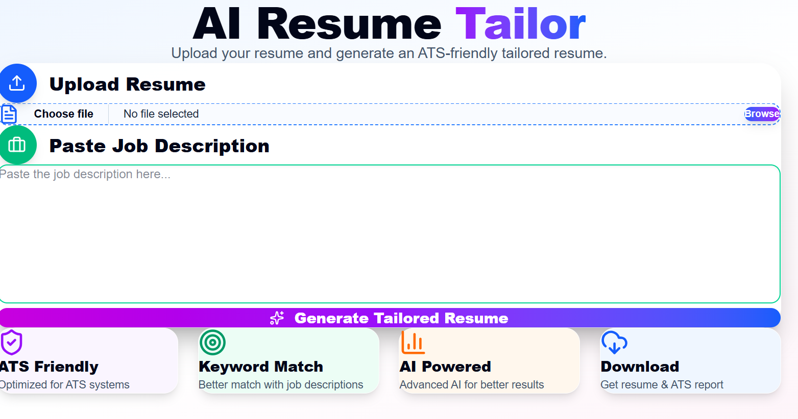
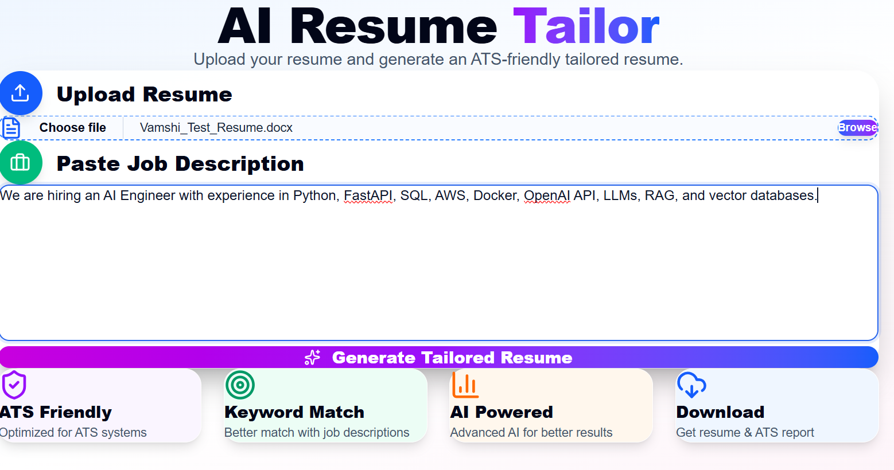
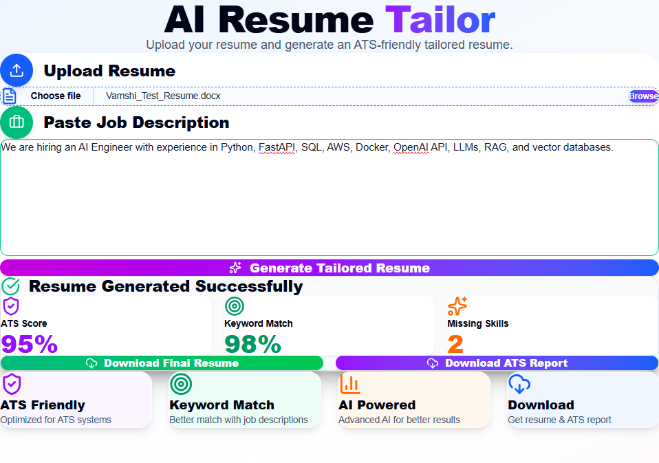

# 🚀 AI Resume Tailor

An AI-powered web application that analyzes a resume against a job description and generates an ATS-friendly tailored resume along with an ATS compatibility report.

---

## 🚀 Workflow

```text
Upload Resume
        │
        ▼
Paste Job Description
        │
        ▼
AI Resume Analysis
        │
        ▼
ATS Report Generation
        │
        ▼
Tailored Resume Generation
        │
        ▼
Download Final Resume
```

## 📸 Project Preview

### 🏠 Home Page



---

### 📄 Resume Upload & Job Description



---

### 🎯 Generated Resume & ATS Report



---

# ✨ Features

- 📄 Upload Resume (DOCX/PDF)
- 📝 Paste Job Description
- 🤖 AI-powered Resume Analysis
- 📊 ATS Compatibility Score
- 🎯 Keyword Match Analysis
- ⚠️ Missing Skills Detection
- 📄 Generate Tailored Resume
- 📑 Generate ATS Report
- ⬇️ Download Final Resume
- 📥 Download ATS Report
- ⚡ FastAPI Backend
- 💻 Next.js Frontend
- 🧩 Modular Project Architecture

---

# 🛠 Tech Stack

## Frontend

- Next.js
- React
- Tailwind CSS
- Axios
- Lucide React Icons

## Backend

- Python
- FastAPI
- OpenAI API
- python-docx
- Pydantic
- Uvicorn
- CORS Middleware

---

# 📂 Project Structure

```text
AI-Resume-Tailor/
│
├── backend/
│   │
│   ├── api/
│   │     └── resume_routes.py
│   │
│   ├── services/
│   │     └── resume_service.py
│   │
│   ├── core/
│   │     └── config.py
│   │
│   ├── utils/
│   │     ├── ai_analyzer.py
│   │     ├── jd_analyzer.py
│   │     ├── resume_generator.py
│   │     └── resume_parser.py
│   │
│   ├── uploads/
│   │
│   ├── main.py
│   ├── requirements.txt
│   └── .env
│
├── frontend/
│   │
│   ├── app/
│   │     ├── page.js
│   │     ├── layout.js
│   │     └── globals.css
│   │
│   ├── public/
│   ├── package.json
│   └── node_modules/
│
├── README.md
└── .gitignore
```

---

# ⚙️ System Architecture

```text
User
   │
   ▼
Next.js Frontend
   │
   ▼
FastAPI Backend
   │
   ▼
Resume Parser
   │
   ▼
Job Description Analyzer
   │
   ▼
OpenAI API
   │
   ▼
Tailored Resume Generator
   │
   ▼
ATS Report Generator
   │
   ▼
Download Resume + ATS Report
```

---

# 🚀 Installation

## Clone Repository

```bash
git clone https://github.com/Vamshidhar2308/AI-Resume-Tailor.git
```

```bash
cd AI-Resume-Tailor
```

---

# Backend Setup

```bash
cd backend
```

Create Virtual Environment

```bash
python -m venv .venv
```

Activate

Windows

```bash
.venv\Scripts\activate
```

Install Dependencies

```bash
pip install -r requirements.txt
```

Run Backend

```bash
uvicorn main:app --reload
```

Backend URL

```
http://127.0.0.1:8000
```

Swagger Documentation

```
http://127.0.0.1:8000/docs
```

---

# Frontend Setup

```bash
cd frontend
```

Install Packages

```bash
npm install
```

Run Next.js

```bash
npm run dev
```

Frontend URL

```
http://localhost:3000
```

---

# 🔑 Environment Variables

Create

```
backend/.env
```

Add

```env
OPENAI_API_KEY=YOUR_OPENAI_API_KEY
```

---

# 📊 Current Functionalities

✅ Resume Upload

✅ Job Description Upload

✅ Resume Parsing

✅ AI Resume Analysis

✅ ATS Score

✅ Keyword Match

✅ Missing Skills Detection

✅ Tailored Resume Generation

✅ ATS Report Generation

✅ Download Tailored Resume

✅ Download ATS Report

✅ Responsive Next.js Interface

✅ FastAPI REST APIs

✅ Modular Backend Architecture

---

# 📈 Future Roadmap

### Phase 2

- Better ATS Algorithm
- Dynamic Keyword Extraction
- Skills Recommendation
- Resume Version Comparison
- Resume Improvement Suggestions

### Phase 3

- Cover Letter Generator
- LinkedIn Job Scraper
- Automatic Job Tracker
- Gmail Integration
- Resume History

### Phase 4

- One-click Apply
- Recruiter Dashboard
- Chrome Extension
- Multi-language Resume Support
- Cloud Deployment (AWS/Azure)

---

# 🎯 Use Cases

- AI/ML Engineers
- Software Engineers
- Data Scientists
- Students
- Job Seekers
- Recruiters
- Career Coaches

---

## 📸 Screenshots

### 🏠 Home Page


---

### 📄 Resume Upload & Job Description


---

### 🎯 Generated Resume & ATS Report

## 

# 👨‍💻 Author

## Vamshidhar Thella

AI/ML Engineer

Python • FastAPI • Next.js • OpenAI • Machine Learning • Generative AI

---

# ⭐ Project Status

🚀 Version 1.0 Complete

Currently under active development with new AI-powered features being added regularly.

---

## 📄 License

This project is for educational and portfolio purposes.
